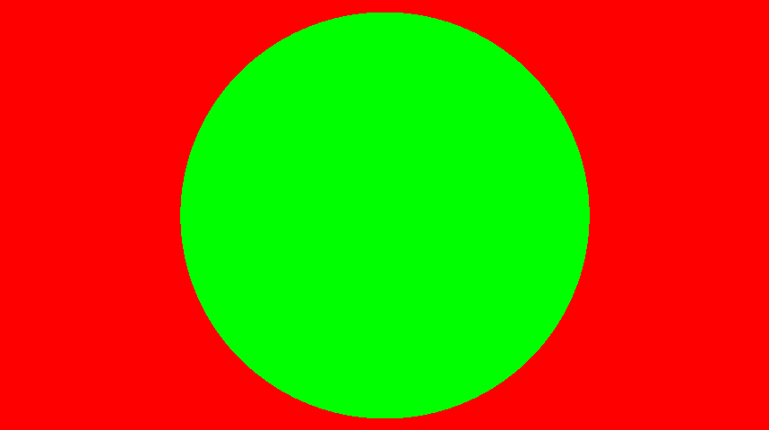
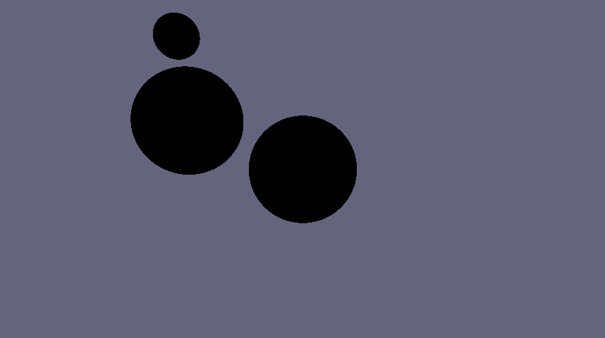
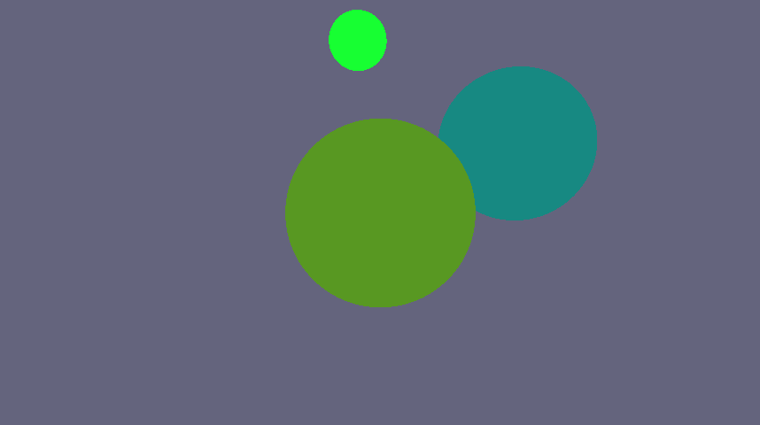
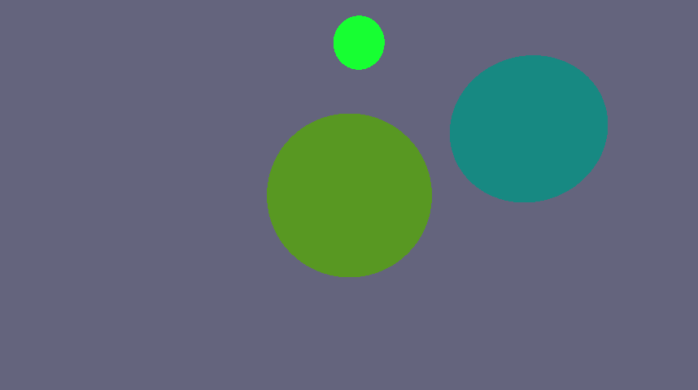
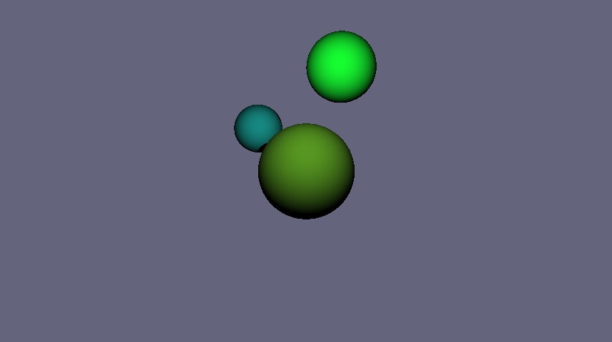
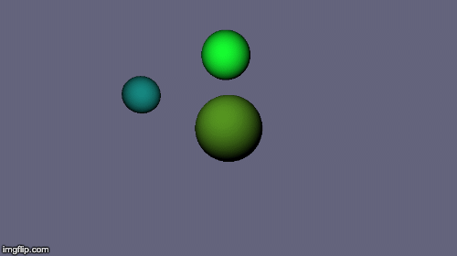

# Marching for Rays
This is a ray marcher demo I made in 2019. I was inspired after taking the Linear Algebra course at the university and wanted to try to implement a ray marcher with the knowledge I had in my head. And it kinda works! Yay! :) 

It's not at the least optimized, but it serves as a pretty decent proof of concept.

I also included some of the progress images showing the different results I got during the development process. 

## Progress images
My [first success](images/första.txt).. is the output of the console – it was a really satisfying moment!

My second success was this image:

Second image:

Third:

My first animation!! 🎞

Let there be LIGHT! First shaded one.

And the final animation, with lighting and shading. 

Here's a video of the program running in real time: [video](images/ScreenRecording2019-11-04at01.27.25.mov)

---

This is by no means a finished product, it's more like a fun work in progress. Teaching myself some graphics principals. 😎